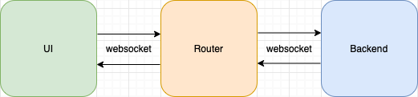

# Overview

This is my submission for the picky assessment.
The service starts a front end web application which will +1 to a number starting from 0, every second (unless paused or stopped), until it reaches 100.

## How to run

To demo this project run the following:
```
docker-compose up
```

and navigate to `localhost:3000` in your browser (use chrome for best results).

## Design


This project is made up of 3 components:

### Frontend 
  
React application that controls the counter by either starting, pausing, or cancelling it. It establishes a websocket connection with the router component.

### Router

NodeJs application that accepts connections from both the frontend and backend components and routes them accordingly over websockets.

### Backend

Python application which receives signals from the router which indicate one of the following acitons: start counting, pause counting, cancel counting. It sends the sum value back to the router over websockets.

## Project Structure
```
.
├── docker-compose.yml          (1)
├── backend
│   └── src                     (2)
├── frontend
│   ├── create-env-vars.sh      (3)
│   └── src                     (4)
└── router
    └── src                     (5)
```

1. docker-compose file for spinning up services
1. application code for backend app
1. helper script for injecting environment variables into frontend app container (react)
1. application code for frontend app
1. application code for router app